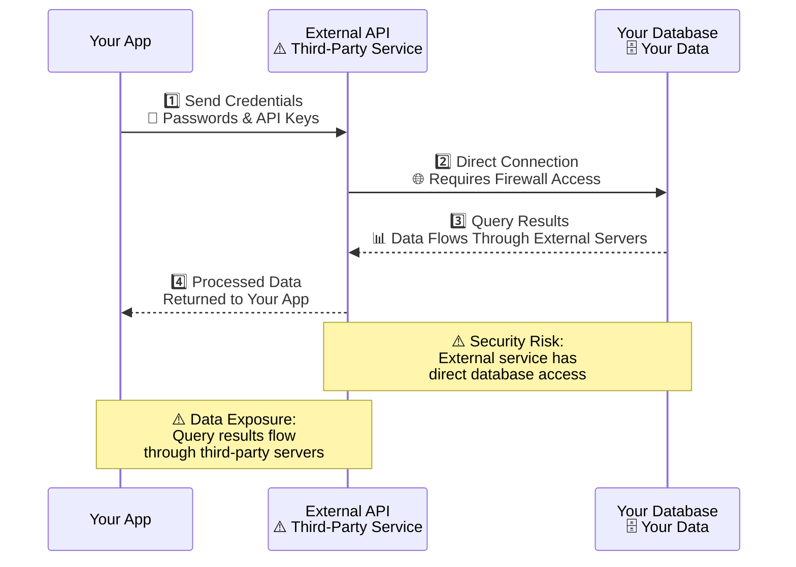
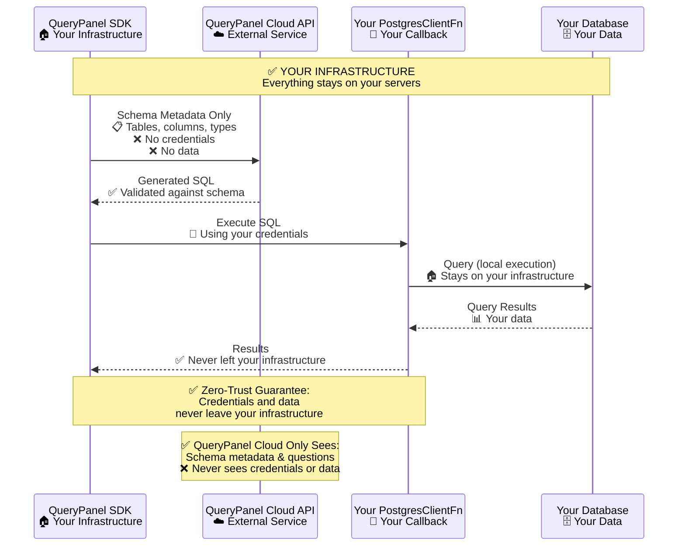
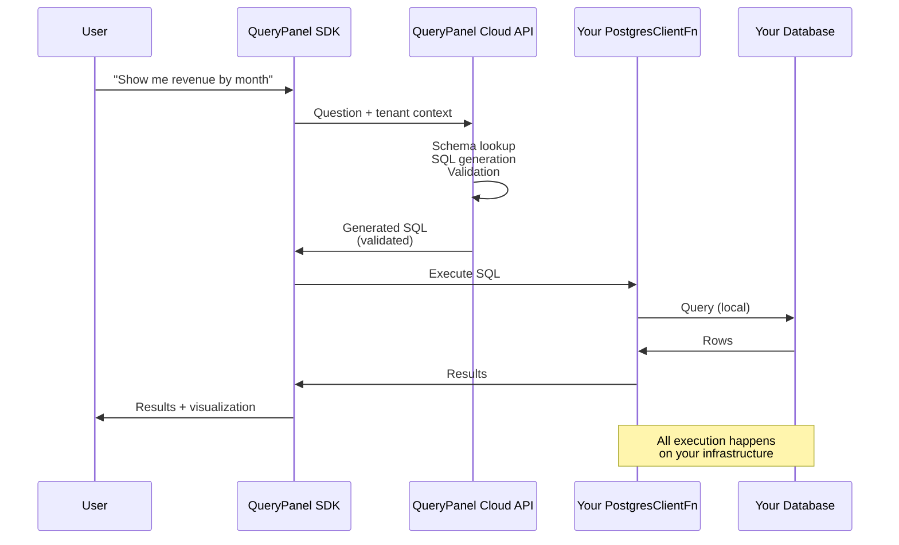

# Zero-Trust SDK Architecture: The Callback Pattern

**Topic**: Zero-trust SDK architecture, callback pattern, database security, multi-tenant security, SQL execution security, credential management, data privacy.

**Keywords**: QueryPanel, zero-trust architecture, callback pattern, database security, SDK security, PostgreSQL security, ClickHouse security, multi-tenant security, credential management, SQL execution, data privacy, compliance, HIPAA, SOC2, GDPR.

Most AI-powered analytics tools require you to hand over database credentials or route queries through external servers. Even worse, your actual data often flows through LLM providers. Your sensitive business data becomes training fodder or sits in third-party logs. As the AI tooling ecosystem grows, more vendors get access to your data. Your SaaS provider, their LLM vendor, their vector database, their observability stack. They all see your data.

QueryPanel takes a fundamentally different approach: **your credentials and data never leave your infrastructure**.

This post explains the architectural decisions behind our zero-trust model and how the callback pattern makes it possible. QueryPanel is a natural language to SQL SDK that uses a callback-based architecture to execute SQL queries locally on your infrastructure, ensuring zero-trust security for multi-tenant SaaS applications.

## The Problem with Traditional Approaches

Consider how most NL-to-SQL solutions work:



The external service holds your credentials and connects to your database directly. This creates several issues:

1. **Credential exposure**. Your database password exists in a third-party system
2. **Data exfiltration risk**. Query results pass through external infrastructure
3. **Compliance violations**. Many regulations prohibit sending data to third parties
4. **Network complexity**. You need to whitelist external IPs and open firewall rules

## QueryPanel's Callback Architecture

QueryPanel inverts this model. The SDK runs in your backend and uses a **callback function** to execute queries:



The key insight: **QueryPanel Cloud only receives schema metadata**. It never sees credentials, never connects to your database, and never receives query results.

Since all SQL execution flows through your callback function, you have complete control over query validation and execution. The SDK automatically validates generated SQL using your database provider's native validation features (like ClickHouse's `EXPLAIN` method). But you can also add custom validation logic, review queries in your logs, or reject queries that don't meet your security policies. All before execution.

## How It Works

### Step 1: Attach Your Database with a Callback

When initializing the SDK, you provide a callback function that knows how to execute SQL:

```typescript
import { QueryPanelSdkAPI, PostgresClientFn } from '@querypanel/node-sdk';

// This function stays in YOUR code, on YOUR servers
function createPostgresClientFn(): PostgresClientFn {
  return async (sql: string, params?: unknown[]) => {
    // Use your existing connection pool, ORM, or client
    const result = await yourDbPool.query(sql, params);
    return {
      rows: result.rows,
      fields: result.fields.map(f => ({ name: f.name }))
    };
  };
}

const sdk = new QueryPanelSdkAPI(
  process.env.QUERYPANEL_API_URL,
  process.env.MY_PRIVATE_KEY,    // Your key, for signing JWTs
  process.env.ORGANIZATION_ID
);

sdk.attachPostgres('analytics', createPostgresClientFn(), {
  database: 'postgres',
  description: 'Analytics database',
  tenantFieldName: 'tenant_id',
  enforceTenantIsolation: true,
  allowedTables: ['orders', 'customers', 'products']
});
```

Notice what's happening here:
- **Your callback** contains the database connection logic
- **Your private key** signs authentication tokens
- **QueryPanel** never receives connection strings or passwords

### Step 2: Sync Schema Metadata

Before querying, the SDK extracts schema metadata and sends it to QueryPanel Cloud:

```typescript
await sdk.syncSchema('analytics', { tenantId: 'customer_123' });
```

What gets sent:
- Table names
- Column names and types
- Foreign key relationships
- Your custom annotations and glossary terms

What **never** gets sent:
- Connection strings
- Passwords or credentials
- Actual data rows
- Query results

### Step 3: Ask Questions

When a user asks a question, the flow is:

```typescript
const result = await sdk.ask("Show me revenue by month", {
  database: 'analytics',
  tenantId: 'customer_123'
});
```

Under the hood:

1. **SDK → QueryPanel Cloud**: Sends the natural language question + tenant context
2. **QueryPanel Cloud → SDK**: Returns generated SQL (validated against your schema)
3. **SDK → Your Callback**: Executes SQL using your `PostgresClientFn`
4. **Your Callback → SDK**: Returns rows from your database
5. **SDK → Your App**: Returns results + visualization spec



## The Security Properties

This architecture gives you several guarantees:

### 1. Credentials Never Leave Your Infrastructure

Your database password only exists in your callback function. QueryPanel Cloud has no way to request or receive it.

### 2. Data Never Leaves Your Infrastructure

Query results flow directly from your database to your application. QueryPanel Cloud only sees the question and returns SQL. It never sees the answer.

### 3. JWT-Based Authentication

The SDK signs requests using your private key. QueryPanel Cloud verifies signatures using your public key (uploaded during setup). So:

- No shared secrets
- Requests can't be forged
- You can rotate keys without coordination

```typescript
// Your private key signs the JWT
const sdk = new QueryPanelSdkAPI(
  apiUrl,
  process.env.MY_PRIVATE_KEY,  // RSA, EC, or Ed25519
  organizationId
);
```

### 4. Tenant Isolation is Enforced Locally

When you configure `enforceTenantIsolation: true`, the SDK automatically injects tenant filtering:

```sql
-- Generated SQL always includes tenant filter
SELECT * FROM orders WHERE tenant_id = $1 AND ...
```

This happens in the SDK before execution. QueryPanel Cloud doesn't need to trust that you'll filter correctly.

### 5. Table Allowlisting

You explicitly declare which tables are accessible:

```typescript
sdk.attachPostgres('analytics', callback, {
  allowedTables: ['orders', 'customers', 'products']
});
```

The SDK validates generated SQL against this allowlist before execution. Queries referencing unauthorized tables are rejected locally.

### 6. Full Client Control Over SQL Execution

The SDK automatically validates generated SQL using your database provider's native validation features (like ClickHouse's `EXPLAIN` method) before execution. Since all SQL execution goes through your callback, you have full visibility and can add additional validation layers if needed.

This means you can:
- Review generated SQL in your logs before execution
- Implement custom validation logic tailored to your security policies
- Add performance checks or query cost limits
- Reject queries that don't meet your additional criteria

The callback pattern ensures nothing executes without going through your code. This gives you a final checkpoint for every query, even beyond the SDK's built-in validation.

## Real-World Implementation

Here's how we implement this in our demo application:

```typescript
// app/api/demo/ask/route.ts

import { QueryPanelSdkAPI, PostgresClientFn } from '@querypanel/node-sdk';
import { executeSql } from '@/lib/demo/postgres-client';

function createPostgresClientFn(): PostgresClientFn {
  return async (sql: string, params?: unknown[]) => {
    // executeSql uses YOUR Supabase client with YOUR credentials
    return executeSql(sql, params);
  };
}

export async function POST(request: NextRequest) {
  const { question } = await request.json();
  
  const sdk = getSdk();  // Singleton with your private key
  
  // Schema sync (only metadata goes to cloud)
  await sdk.syncSchema('netflix_demo', { tenantId: 'demo_user' });
  
  // Ask (SQL comes back, callback executes locally)
  const response = await sdk.ask(question, {
    database: 'netflix_demo',
    tenantId: 'demo_user'
  });
  
  return NextResponse.json({
    success: true,
    sql: response.sql,
    rows: response.rows,        // Never left your infrastructure
    chart: response.chart
  });
}
```

The `executeSql` function uses your Supabase admin client:

```typescript
// lib/demo/postgres-client.ts

export async function executeSql(sql: string, params?: unknown[]) {
  const client = createAdminClient();  // Your credentials
  
  const { data, error } = await client.rpc('exec_sql', {
    query: sql,
    params: params || []
  });
  
  return { rows: data, fields: extractFields(data) };
}
```

## When to Use This Pattern

The callback architecture is ideal when:

- **Compliance requirements** prohibit sending data to third parties
- **Security policies** require credentials to stay on-premises
- **Network restrictions** prevent opening inbound connections
- **Multi-tenant applications** need guaranteed tenant isolation
- **Regulated industries** (healthcare, finance) need audit trails

## Conclusion

Zero-trust isn't just a marketing term. It's an architectural decision. By using a callback pattern, QueryPanel ensures that the most sensitive parts of your system (credentials, data) never leave your control.

The tradeoff is that you run slightly more code on your servers. But in exchange, you get:

- **No credential exposure**
- **No data exfiltration risk**
- **No compliance headaches**
- **No network complexity**

Your data stays yours. That's the point.

---

## Further Reading

- [Getting Started with QueryPanel](/blog/getting-started)
- [Multi-Tenant Security](/blog/multi-tenant-security)
- [Building Dashboards](/blog/building-dashboards)
